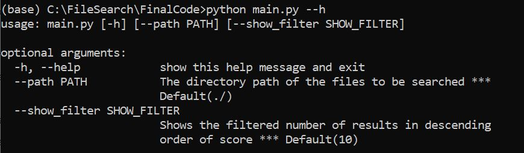
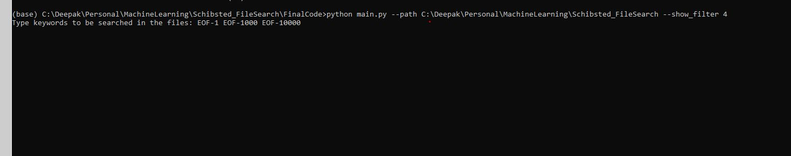
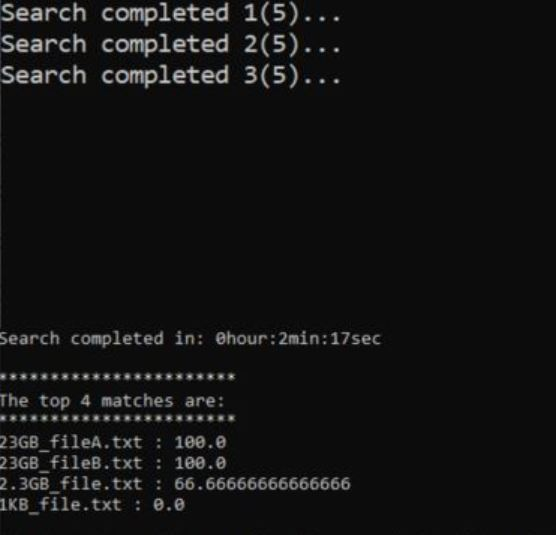

# SearchEngine
**Description:**  This repository facilitates searching mechanism with a pre-scoped functionality. User input key-words are scanned across all the files(.txt) in a given directory.
                  *(found keywords / total search keywords)X100* is considered to be the top scorer in showing in the output. Like such by default top 10 matches will be shown.
          
**Input:**        *main.py* is the main file to run. In the python commandline interface, --help can be seen for the options to run the code.
                        

**Input Example:**  The input parameters are the file path and the filtered results. The input key-words can be eighter with the delimeters(';' ' ', ',')
                    
                  
**Output:**       The output looks like
                    
                  
**Technical highlights:**   
* Tested the search functionality with heavy text file sizes ***(50 GB)*** in a diretory, two files of them are ***23 GB*** each
* Using ***multi-processing*** search on heavy files were done in 2-3 minutes.
                   
                   
**Future improvements(TODO):**   
* Logging
* Performance in speed
* Extending to various file formats
* Input validations refinment
